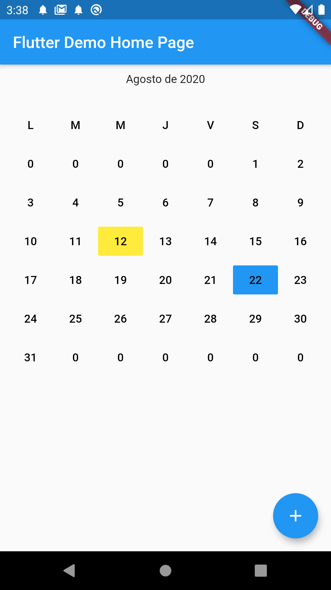

# g_simple_calendar

Simple Calendar Widget 

## Getting Started

For help getting started with Flutter, view our online [documentation](https://flutter.io/).

## Props

| props           | types                    | defaultValues                |
| --------------- | ------------------------ | ---------------------------- |
| date            | DateTime                 |                              |
| customButtons   | List<GCustomButtonModel> | length = 0                   |
| onRangeSelected | Function(List<int>)      | null, get data selected days |
| visibleTitle    | bool                     | false                        |

## Install

Add `g_simple_calendar` as a dependency in pubspec.yaml For help on adding as a dependency, view the [documentation](https://flutter.io/using-packages/).

## Usage

```dart
Widget build(BuildContext context) {
    
    var custom = List<GCustomButtonModel>();

    custom.add(GCustomButtonModel(
      number: 12,
      fillColor: Colors.yellow
    ));

    custom.add(GCustomButtonModel(
      number: 22,
      fillColor: Colors.blue,
      enable: false
    ));
    
    return Scaffold(
      appBar: AppBar(
        title: Text(widget.title),
      ),
      body: GSimpleCalendar(
        date: DateTime.now(),
        customButtons: custom
      ),
    );
  }
```



## About me

[80bits.com](https://80bits.com)

[80bits.blog](https://80bits.blog)

